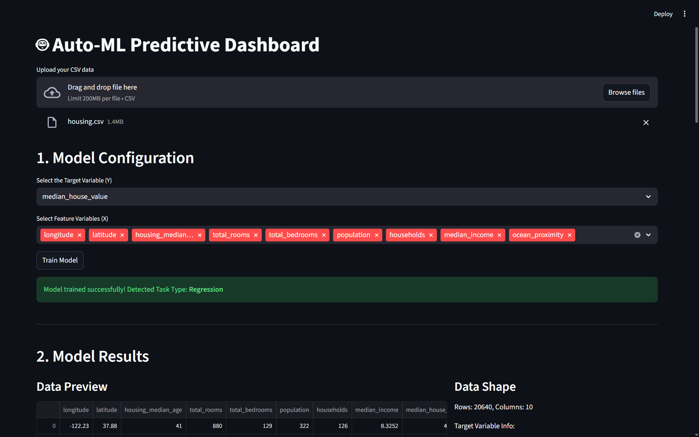
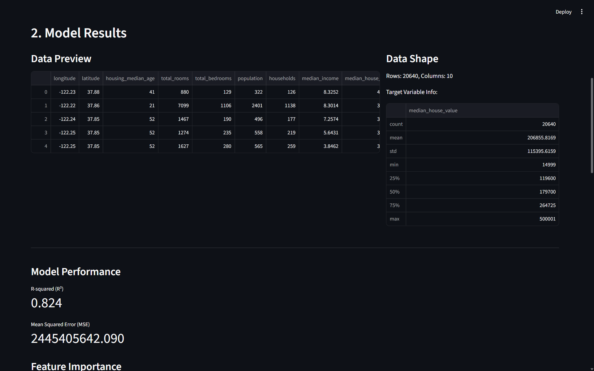
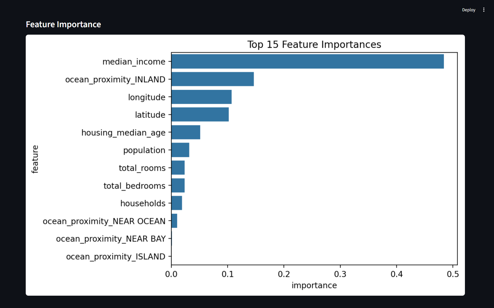
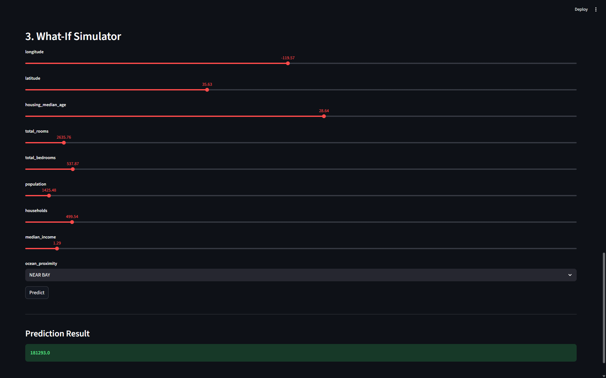

# 🤖 Auto-ML Predictive Dashboard 📈

An interactive Streamlit web app that lets you upload any CSV file, automatically trains a machine learning model (classification or regression), and provides a 'What-If' simulator for instant predictions.






---

## Features

- **Easy Data Upload:** Upload any dataset in `.csv` format.
- **Flexible Configuration:** Interactively select your **target variable** (what you want to predict) and the **feature variables** (the inputs).
- **Automatic Task Detection:** The app automatically determines if you have a **Classification** or **Regression** problem based on your target variable.
- **One-Click Model Training:** Trains a robust **Random Forest** model with a single click.
- **Data Exploration:** Displays a preview of your data, its shape, and key statistics about the target variable.
- **Performance Metrics:** Instantly see how well your model performed:
    * **For Classification:** Accuracy Score and a visual Confusion Matrix.
    * **For Regression:** R-squared (R²) and Mean Squared Error (MSE).
- **Explainable AI:** Generates a **Feature Importance** chart to show which factors most influence the model's predictions.
- **"What-If" Simulator:** An interactive form that lets you input custom values for each feature and get an instant prediction from the trained model.

---

## ⚙️ How It Works

1.  **Upload:** The user uploads a CSV file using the file uploader.
2.  **Configure:** The user selects the target (Y) and feature (X) columns from dropdowns.
3.  **Train:** The user clicks the **"Train Model"** button.
4.  **Analyze:** The app springs into action:
    * It preprocesses the data, handling categorical features with **one-hot encoding**.
    * It detects the problem type (Regression or Classification).
    * It splits the data (80% train, 20% test) and trains a `RandomForest` model.
    * It displays the model's performance metrics and feature importance.
5.  **Predict:** The "What-If" simulator appears, populated with sliders for numerical data and dropdowns for categorical data. The user can adjust these values and click **"Predict"** to see the live result.

---

## 💻 Technologies Used

- **Python 3.x**
- **Streamlit:** For the interactive web UI.
- **Pandas:** For data manipulation and one-hot encoding.
- **Scikit-learn:** For model training (`RandomForestClassifier`, `RandomForestRegressor`), data splitting (`train_test_split`), and metrics (`accuracy_score`, `r2_score`, etc.).
- **Matplotlib & Seaborn:** For plotting the confusion matrix and feature importance.

---

## 📦 How to Run Locally

Follow these steps to get the app running on your local machine.

### 1. Clone the Repository
```bash
git clone https://github.com/ayaantuts/auto-ml-dashboard.git
cd auto-ml-dashboard
```

### 2. Create a Virtual Environment (Recommended)
```bash
python -m venv venv
source venv/bin/activate  # On Windows, use: venv\Scripts\activate
```
### 3. Install Dependencies
Install all the required libraries:
```bash
pip install -r requirements.txt
```

### 4. Run the Streamlit App
```bash
streamlit run app.py
```
The browser will automatically open to the app's local URL (usually `http://localhost:8501`).